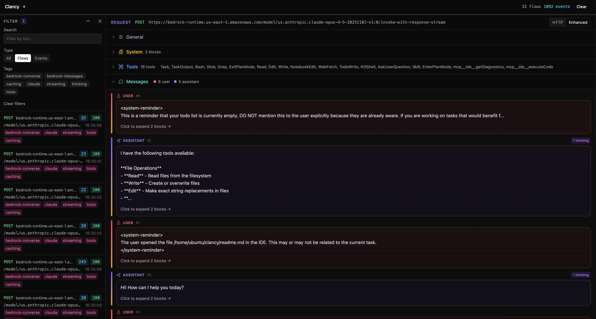

# Clancy

HTTP/HTTPS proxy with real-time monitoring for Agent traffic. Designed for debugging and monitoring Claude Code, Anthropic API calls, and other AI agent communications.





## Features

- **Real-time monitoring** - WebSocket-based live updates as requests flow through
- **HTTP/HTTPS proxy** - Full support for both protocols with TLS interception
- **TLS fingerprinting** - Spoof browser TLS fingerprints using uTLS
- **SSE parsing** - Automatic parsing and display of Server-Sent Events
- **Request/Response inspection** - View headers, bodies, timing, and more
- **Enhanced view for agent traffic** - View tools, system prompt, messages etc. inside LLM API calls

It has been tested with:
- Claude code
- Claude code (Bedrock)
- OpenCode (Bedrock)


## Quick Start (npx)

Run it with npx:

```bash
npx clancy-proxy
```

## Quick Start (from source)


```bash
# Install dependencies
npm install

# Build and start the server
npm start
```

The server will start on `http://localhost:9090` with the web dashboard.

## Usage

### Basic Usage


### With Claude Code

```bash
HTTP_PROXY=http://localhost:9090 \
HTTPS_PROXY=http://localhost:9090 \
NODE_TLS_REJECT_UNAUTHORIZED=0 \
claude
```

### With open code:
```
HTTP_PROXY=http://localhost:9090 HTTPS_PROXY=http://localhost:9090 NODE_TLS_REJECT_UNAUTHORIZED=0 opencode
```

Other applications might work as well.

### With curl

```bash
curl -x http://localhost:9090 -k https://api.anthropic.com/v1/messages
```

## CLI Options

```
Options:
  -p, --port <port>                Port to listen on (default: "9090")
  -t, --tls-provider <provider>    TLS provider: 'utls' (Go fingerprinting) or 'native' (Node.js TLS) (default: "native")
  -f, --tls-fingerprint <fp>       TLS fingerprint for utls (default: "electron")
  -h, --help                       Display help
```

### TLS Fingerprints (with uTLS)

When using `--tls-provider utls`, you can specify a browser fingerprint:

- `chrome120`, `chrome102`, `chrome100`
- `firefox120`, `firefox105`, `firefox102`
- `safari16`
- `edge106`, `edge85`
- `ios14`
- `android11`
- `electron`
- `randomized`
- `golanghttp2`

Example:
```bash
npm start -- --tls-provider utls --tls-fingerprint chrome120
```

## Development

```bash
# Run frontend dev server (hot reload)
npm run dev

# Run just the proxy server (watches for changes)
npm run dev:server

# Run tests
npm test

# Run tests once
npm run test:run

# Lint code
npm run lint
```

## API Endpoints

The proxy server exposes a REST API for accessing captured traffic:

| Endpoint | Method | Description |
|----------|--------|-------------|
| `/api/flows` | GET | Get all captured flows |
| `/api/flows` | DELETE | Clear all captured flows |
| `/api/flows/:id` | GET | Get a specific flow |
| `/api/flows/:id/events` | GET | Get SSE events for a flow |
| `/api/flows/:id/raw` | GET | Get raw HTTP request/response |

## WebSocket

Connect to `ws://localhost:9090/ws` for real-time flow updates:

```javascript
const ws = new WebSocket('ws://localhost:9090/ws')

ws.onmessage = (event) => {
  const data = JSON.parse(event.data)
  // data.type can be: 'init', 'flow', 'event', 'clear'
  console.log(data)
}
```

## Troubleshooting

### Certificate errors

If you see certificate errors, ensure you're setting `NODE_TLS_REJECT_UNAUTHORIZED=0` or trust the CA certificate generated in `certs/`.

### Port already in use

Change the port with `-p`:
```bash
npm start -- -p 8080
```

### TLS fingerprint detection

Some services like Claude Desktop detect and block Node.js TLS fingerprints. Use uTLS provider:
```bash
npm start -- --tls-provider utls --tls-fingerprint chrome120
```

### Go binary not found

The uTLS provider requires a pre-built Go binary. Build it:
```bash
cd server/tls-go
go build -o ../tls-proxy
```


> ⚠️ **Warning:** Only use this proxy in trusted networks!  
> Disabling cert checking exposes you to man-in-the-middle (MITM) attacks between the application and the proxy, which in case of agents means RCE on your machine. Only proxy over a trusted network or don't disable cert checking and trust the cert generated in `certs`.
