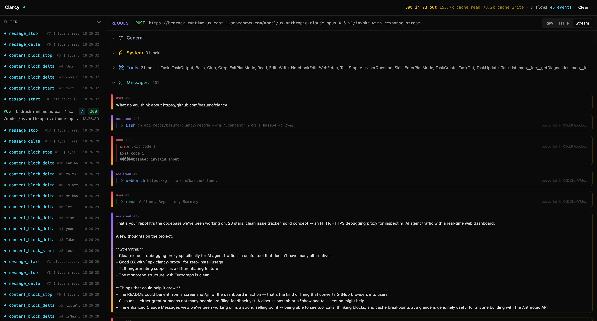

# Clancy

HTTP/HTTPS debugging proxy with a real-time web UI. Built for inspecting AI agent traffic (Claude Code, Bedrock, etc.) but works with anything.



## Install

```bash
npx clancy-proxy@latest
```

Or install globally:

```bash
npm install -g clancy-proxy@latest
clancy
```

Opens a web dashboard at `http://localhost:9090`.

## Proxying traffic

### Node.js apps (Claude Code, OpenCode, etc.)

```bash
HTTP_PROXY=http://localhost:9090 \
HTTPS_PROXY=http://localhost:9090 \
NODE_TLS_REJECT_UNAUTHORIZED=0 \
claude
```

### Electron apps (Claude Desktop)

```bash
/Applications/Claude.app/Contents/MacOS/Claude \
  --proxy-server="http://localhost:9090" \
  --ignore-certificate-errors
```

### curl

```bash
curl -x http://localhost:9090 -k https://api.anthropic.com/v1/messages
```

## CLI options

```
-p, --port <port>              Port to listen on (default: 9090)
-H, --host <host>              Host to bind to (default: localhost)
-t, --tls-provider <provider>  'utls' or 'native' (default: native)
-f, --tls-fingerprint <fp>     Browser fingerprint for utls (default: electron)
-c, --certs-dir <path>         Persist CA certs to disk (in-memory if omitted)
```

### TLS fingerprinting

Some services detect and block Node.js TLS fingerprints. Use `--tls-provider utls` to spoof a browser fingerprint:

```bash
clancy --tls-provider utls --tls-fingerprint chrome120
```

Available fingerprints: `chrome120`, `chrome102`, `chrome100`, `firefox120`, `firefox105`, `firefox102`, `safari16`, `edge106`, `edge85`, `ios14`, `android11`, `electron`, `randomized`, `golanghttp2`

## Development

```bash
npm install
npm run dev           # frontend + backend with hot reload
npm run dev:server    # backend only
npm run test          # run tests
npm run lint          # lint
```

## Security

> **Warning:** Disabling certificate verification (`NODE_TLS_REJECT_UNAUTHORIZED=0`, `--ignore-certificate-errors`, `-k`) exposes traffic between the app and the proxy to MITM attacks. For AI agents, this means potential RCE on your machine. Only do this on trusted networks.
>
> To avoid disabling verification, use `-c ./certs` to persist the CA certificate and trust it in your OS/app instead.
